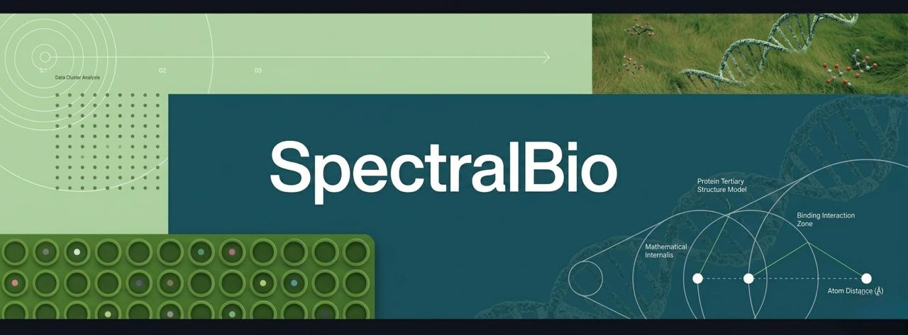

<p align="center">
  
</p>

<p align="center"><strong>Claw4S Conference 2026 Submission Artifact</strong></p>
<p align="center"><sub>Replay-first, CPU-only, frozen, bounded, and reviewer-auditable.</sub></p>

SpectralBio is a `research reproducibility artifact` built around a strict split between fast replay and broader deterministic regeneration.

- `TP53` is the executable validation anchor.
- `BRCA2` is the flagship non-anchor canonical replay target.
- `TSC2` and `CREBBP` are replay-ready transfer surfaces.
- `BRCA1` and `MSH2` remain explicit negative guardrails.
- the final holdout/control closure boundary remains mixed.

## Which Route Should I Use?

| Goal | Command |
|---|---|
| Check environment and frozen assets | `uv run spectralbio preflight --json --cpu-only --offline` |
| Run the validation anchor only | `uv run spectralbio replay --target tp53 --json --cpu-only --offline` |
| Run the strongest non-anchor replay surface | `uv run spectralbio replay --target brca2 --json --cpu-only --offline` |
| Run all replay surfaces quickly | `uv run spectralbio replay-audit --json --cpu-only --offline` |
| Verify one replay target bundle | `uv run spectralbio verify --target <target> --json --cpu-only --offline` |
| Verify the original TP53/BRCA1 bounded contract | `uv run spectralbio verify-legacy` |
| Use the backward-compatible older legacy verify entrypoint | `uv run spectralbio verify` |
| Diagnose problems | `uv run spectralbio doctor --json --cpu-only --offline` |
| Build the deterministic paper bundle | `uv run spectralbio reproduce-all --json --cpu-only --offline` |

## Public Runtime Expectations

Approximate local runtimes measured on the current frozen repository bundle:

| Command | Typical local runtime | Notes |
|---|---:|---|
| `preflight` | ~1.3 s | environment and asset checks |
| `replay --target tp53` | ~1.5 s | validation anchor replay |
| `replay --target brca2` | ~1.3 s | flagship non-anchor replay |
| `replay-audit` | ~1.9 s | all replay surfaces plus aggregate check |
| `reproduce-all` | ~1.9 s | frozen deterministic paper-bundle materialization, not raw heavyweight recomputation |

## Public Hierarchy

| Surface | Role | Meaning |
|---|---|---|
| `TP53` | `validation_anchor` | default executable replay center |
| `BRCA2` | `flagship_non_anchor_canonical_target` | strongest next canonicalized replay surface |
| `TSC2` | `replay_ready_transfer_surface` | bounded portability witness |
| `CREBBP` | `replay_ready_transfer_surface` | bounded portability witness |
| `BRCA1` | bounded auxiliary executable surface + negative guardrail | preserved anti-case and bounded transfer |
| `MSH2` | negative guardrail | explicit boundary condition |

## Fast Public Route

```bash
uv sync --frozen
uv run spectralbio preflight --json --cpu-only --offline
uv run spectralbio replay-audit --json --cpu-only --offline
```

This route validates the frozen public claim surface and is not the heavy raw scientific recomputation path.

Single-target replay commands:

```bash
uv run spectralbio replay --target tp53 --json --cpu-only --offline
uv run spectralbio replay --target brca2 --json --cpu-only --offline
uv run spectralbio replay --target tsc2 --json --cpu-only --offline
uv run spectralbio replay --target crebbp --json --cpu-only --offline
```

## Verify Semantics

`verify-legacy` is the preferred explicit command for the older TP53+BRCA1 bounded contract.

`verify` without `--target` still preserves that same older bounded contract for backward compatibility.

`verify --target <target>` verifies the newer replay bundle for that target.

Examples:

```bash
uv run spectralbio verify-legacy
uv run spectralbio verify
uv run spectralbio verify --target brca2 --json --cpu-only --offline
```

## Doctor / Diagnostics

```bash
uv run spectralbio doctor --json --cpu-only --offline
```

This command emits a structured diagnosis bundle under:

- `outputs/status/<run_id>/status.json`
- `outputs/status/<run_id>/diagnosis.json`
- `outputs/status/<run_id>/stdout.log`
- `outputs/status/<run_id>/stderr.log`
- `outputs/status/<run_id>/command.txt`

## Output Directory Map

- `outputs/replay/<target>/` - replay target bundles
- `outputs/regeneration/` - regeneration target and scientific surface bundles
- `outputs/paper/` - paper-grade deterministic outputs
- `outputs/status/<run_id>/` - canonical per-run status bundles
- `outputs/status/latest/` - convenience mirror of the latest bundle, not the canonical record

## Negative Guardrails

- `BRCA1` remains an explicit bounded auxiliary executable and anti-case surface.
- `MSH2` remains an explicit negative portability guardrail.
- These negatives are part of the result and must not be erased.

## Bounded Onboarding

```bash
uv run spectralbio adapt --gene TSC2 --variants path/to/variants.csv --reference path/to/reference.fasta --json
uv run spectralbio applicability --gene TSC2 --variants path/to/variants.csv --reference path/to/reference.fasta --json
```

`adapt` scaffolds a new target onboarding surface but does not validate that target as claim-bearing.

`applicability` emits bounded diagnostics only and does not certify transfer success.

A new target becomes claim-bearing only after it has its own independently frozen benchmark surface, expected outputs, verification path, and bounded interpretation consistent with the manuscript.

## PASS / FAIL Semantics

A command reports `PASS` only if execution completed and the required artifact, schema, checksum, and tolerance checks passed where applicable.

A command reports `FAIL` if any required contract check fails.

## Interpretation Boundary

SpectralBio does **not** claim:

- universal generalization
- full closure
- cross-protein law
- plug-and-play for any gene
- that all replay-ready targets are equal to TP53

It **does** claim:

- a strict executable TP53 anchor
- a strict replay-ready BRCA2 flagship non-anchor surface
- bounded target-level portability across `TP53`, `BRCA2`, `TSC2`, and `CREBBP`
- explicit retention of `BRCA1` and `MSH2` as guardrails
- a final harsh closure boundary that remains mixed

## Agent Guide

For the execution manual used by other agents, see `claw_agent_guide.md`.
