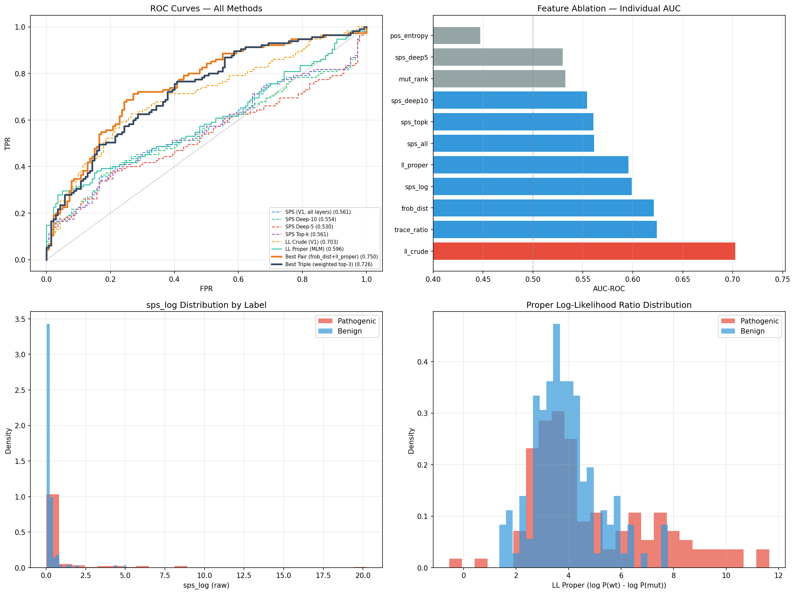

# Introduction

Identifying disease-causing protein variants from sequence alone remains unsolved at scale. Reference datasets such as ClinVar provide curated labels for pathogenic and benign variants, making them useful benchmarks for zero-shot variant effect prediction. Protein language models (PLMs), especially ESM2, have recently shown that sequence likelihood can be a strong baseline for mutation scoring. However, likelihood-based scores only summarize token probability and do not explicitly measure how a mutation changes the internal geometry of the model's hidden representations.

This paper introduces **SpectralBio**, a zero-shot method that analyzes covariance perturbations in ESM2 hidden states around the mutation site. The central hypothesis is that pathogenic mutations induce measurable geometric changes in residue-level hidden states, and that those changes can provide signal complementary to likelihood-based scores. The main empirical findings are that the best TP53 score comes from combining matrix-level covariance distance with proper masked-language-model likelihood, that matrix-level spectral features outperform eigenvalue-only SPS variants on TP53, and that the proper likelihood score achieves a bounded secondary transfer result on a fixed BRCA1 subset without retraining.

Inspired by spectral monitoring ideas from adversarial representation analysis, we ask whether hidden-state covariance structure can detect biologically meaningful perturbations that standard sequence scoring misses. Our results suggest that the answer is yes, but only for some spectral summaries: matrix-level covariance differences are useful, whereas eigenvalue-only SPS variants remain comparatively weak.

## Method

We use ESM2-150M (`facebook/esm2_t30_150M_UR50D`), a 30-layer masked protein language model with hidden dimension 640. For each wild-type and mutant sequence pair, we extract a local window of $\pm 40$ residues around the mutation site and collect residue-level hidden states $H^{(l)} \in \mathbb{R}^{w \times d}$ from each layer $l \in \{1,\dots,L\}$.

For every layer, we compute covariance matrices

$$
C^{(l)} = \operatorname{Cov}(H^{(l)}) \in \mathbb{R}^{d \times d}.
$$

From the wild-type and mutant covariance matrices, we define three spectral features:

$$
\text{FrobDist} = \frac{1}{L}\sum_l \left\|C^{(l)}_{\text{MUT}} - C^{(l)}_{\text{WT}}\right\|_F
$$

$$
\text{TraceRatio} = \frac{1}{L}\sum_l \left|\frac{\operatorname{tr}(C^{(l)}_{\text{MUT}})}{\operatorname{tr}(C^{(l)}_{\text{WT}})} - 1\right|
$$

$$
\text{SPS-log} = \frac{1}{L}\sum_l \left\|\log |\lambda^{(l)}_{\text{MUT}}| - \log |\lambda^{(l)}_{\text{WT}}|\right\|_2^2
$$

where $\lambda^{(l)}$ denotes the eigenvalue spectrum of the covariance matrix at layer $l$. These features capture complementary aspects of mutation-induced representation change: full-matrix displacement, trace-scale change, and eigenvalue shift.

We also compute a **proper masked-LM likelihood** score directly from `EsmForMaskedLM` logits at the mutation position:

$$
\text{LL}(v) = \log P_{\text{ESM2}}(wt_p \mid S_{WT}) - \log P_{\text{ESM2}}(mut_p \mid S_{WT}).
$$

This score differs from the earlier crude likelihood proxy based on hidden-state norm differences. All scalar features are normalized to $[0,1]$ with MinMax scaling, and linear combinations are searched by grid search over $\alpha \in [0,1]$ with step size 0.05. We report AUC-ROC on TP53 as the primary dataset and on a fixed BRCA1 subset as a `secondary transfer evaluation without retraining`. Operationally, this repository is a `research reproducibility artifact` anchored to the `TP53 canonical executable benchmark`, and any broader reuse should be treated as `adaptation recipe only`. All seeds are fixed to 42.

## Results

On TP53, the best individual non-likelihood spectral feature is `TraceRatio` (AUC = 0.6242), followed closely by `FrobDist` (AUC = 0.6209). Both outperform the eigenvalue-only SPS variants, with `SPS-log` at 0.5988 and `SPS-all` at 0.5611. The strongest overall result is the pairwise combination `0.55 * FrobDist + 0.45 * LL Proper`, which reaches **AUC = 0.7498** on $N = 255$ ClinVar variants (115 pathogenic, 140 benign). Relative to the LL Crude baseline of 0.7026, this is a descriptive within-benchmark gain of **0.0472 AUC**.

| Method | AUC-ROC |
| --- | ---: |
| LL Crude (norm proxy, baseline) | 0.7026 |
| TraceRatio (spectral) | 0.6242 |
| FrobDist (spectral) | 0.6209 |
| SPS-log (eigenvalue only) | 0.5988 |
| LL Proper (masked LM) | 0.5956 |
| SPS-all (eigenvalue only) | 0.5611 |
| **FrobDist + LL Proper (0.55 / 0.45)** | **0.7498** |
| LL Crude + TraceRatio + FrobDist | 0.7264 |

Within the TP53 results reported here, **matrix-level covariance features beat eigenvalue-only SPS features**. In other words, retaining the full geometry of the mutation-induced covariance shift appears more informative than compressed eigenvalue summaries alone in this benchmark.

The secondary bounded transfer evaluation on BRCA1 is intentionally narrow. `LL Proper` achieves **AUC = 0.9174** on a fixed BRCA1 subset (`N=100`) without retraining. We report this as bounded transfer on a fixed BRCA1 subset (`N=100`) without retraining, not as evidence of broader cross-protein behavior.

*Figure 1. Canonical TP53 results summary linked to `outputs/canonical/roc_tp53.png`. Rounded values shown inside the figure remain anchored by the exact paper values reported in text.*

## Discussion and Limitations

The main conclusion is that hidden-state covariance geometry can add useful benchmark signal beyond likelihood alone. On TP53, the best score does not come from any single feature but from combining a matrix-level geometric signal (`FrobDist`) with a probabilistic signal (`LL Proper`). This suggests that the two features capture partially distinct aspects of mutation effect within the primary canonical benchmark.

At the same time, the results argue against overclaiming spectral features in general. SPS-only variants are weak, and deeper or top-k layer selection does not materially rescue them: `SPS-topk` reaches 0.5606, `SPS-deep10` 0.5542, and `SPS-deep5` 0.5298 on TP53. The proper likelihood score is also not universally superior, because it underperforms the crude LL baseline on TP53. Its importance comes instead from complementarity in TP53 and from the bounded secondary transfer result on the fixed BRCA1 subset.

Several limitations remain. The study only evaluates two proteins, the local window size is fixed at $\pm 40$, and the model size is limited to 150M parameters. We also did not jointly optimize windowing, layer aggregation, and feature mixing. A broader evaluation on datasets such as ProteinGym is needed before making claims beyond this bounded transfer setting.

## Reproducibility

The experiment uses fixed seeds (`torch`, `numpy`, and `random` all set to 42), public ClinVar data, and the public ESM2-150M checkpoint. Under the repository's canonical execution path, the TP53 canonical executable benchmark reproduces with **reproducibility delta = 0.0**.
